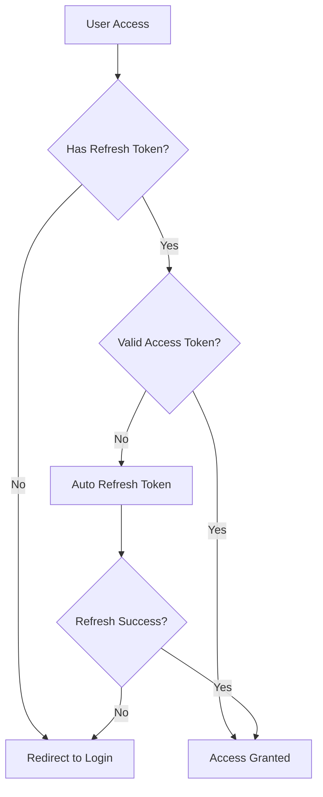
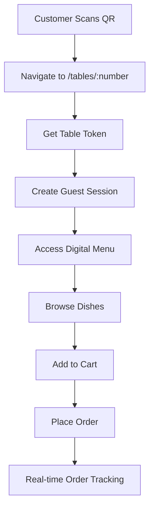
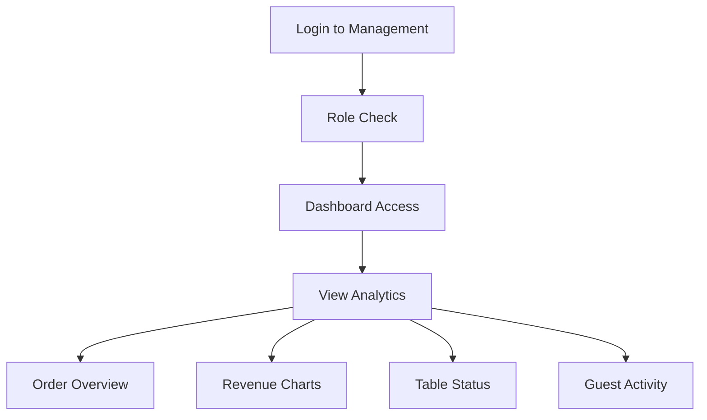
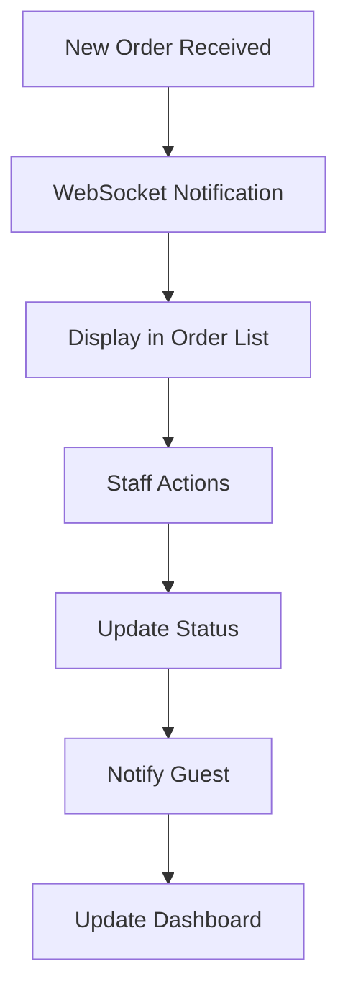
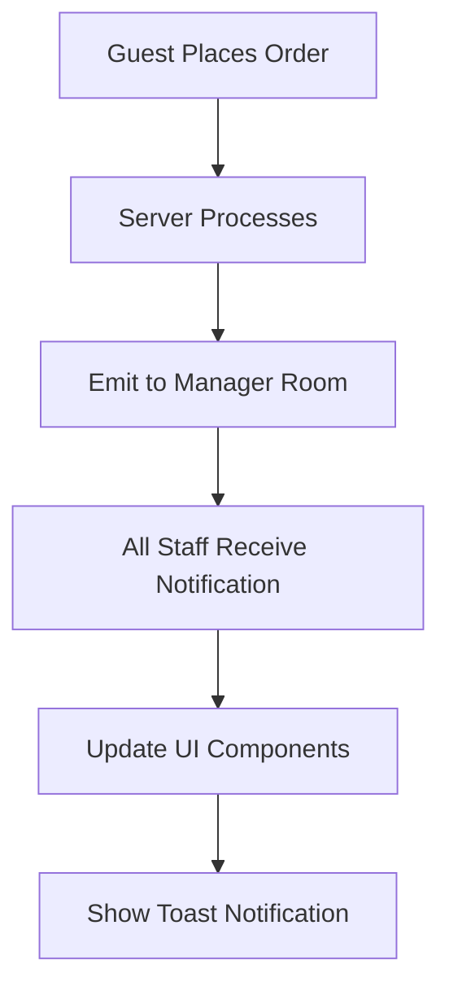
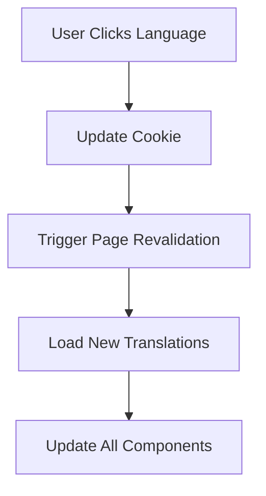

# QR Meal - Application Flow Documentation

## Overview

QR Meal is a modern, full-stack QR code-based restaurant ordering system built with Next.js 15, TypeScript, and React Query. The application provides a seamless contactless dining experience with real-time order management, multi-language support, and comprehensive analytics.

## Architecture Overview

### Tech Stack

- **Frontend**: Next.js 15.4.7 with App Router, React 19.1.0, TypeScript 5
- **Styling**: Tailwind CSS 4, Radix UI components
- **State Management**: TanStack Query (React Query), Zustand
- **Authentication**: JWT-based with refresh tokens
- **Real-time**: Socket.io client for live updates
- **Internationalization**: next-intl (English & Vietnamese)
- **Form Handling**: React Hook Form with Zod validation

### Key Features

- **Role-based Access**: Owner, Employee, Guest roles with different permissions
- **Real-time Updates**: WebSocket integration for live order notifications
- **Multi-language**: Dynamic language switching (EN/VI)
- **Responsive Design**: Mobile-first approach with dark mode support
- **QR Code Integration**: Table-based QR code scanning for menu access

---

## Application Flow

### 1. Authentication Flow

#### 1.1 User Types & Roles

```typescript
// Role definitions
Role = {
  Owner: "Owner", // Full access to all features
  Employee: "Employee", // Order management and basic operations
  Guest: "Guest", // Table-based ordering only
};
```

#### 1.2 Authentication Process



**Key Components:**

- **Middleware**: Route protection and role-based access control (`src/middleware.ts`)
- **RefreshToken Component**: Automatic token refresh handling
- **AppProvider**: Global authentication state management

#### 1.3 Protected Routes

```typescript
// Route access control
managePaths = ["/vi/manage", "/en/manage"]; // Owner + Employee
guestPaths = ["/vi/guest", "/en/guest"]; // Guest only
onlyOwnerPaths = ["/vi/manage/accounts", "/en/manage/accounts"]; // Owner only
```

### 2. Guest Ordering Flow

#### 2.1 QR Code Scanning & Table Access



#### 2.2 Guest Session Management

- **Table Token**: Secure token linking guest to specific table
- **Guest ID**: Unique identifier for order tracking
- **Session Persistence**: Maintains cart and order state

#### 2.3 Order Lifecycle

```typescript
OrderStatus = {
  Pending: "Pending", // Just placed
  Processing: "Processing", // Kitchen preparing
  Rejected: "Rejected", // Cancelled/unavailable
  Delivered: "Delivered", // Ready/served
  Paid: "Paid", // Payment completed
};
```

**Order Flow:**

1. **Cart Management**: Add/remove dishes with quantities
2. **Order Creation**: Batch create multiple order items
3. **Real-time Updates**: WebSocket notifications for status changes
4. **Payment Processing**: Mark orders as paid when completed

### 3. Management Flow (Owner/Employee)

#### 3.1 Dashboard & Analytics



**Dashboard Features:**

- **Revenue Analytics**: Daily/weekly/monthly charts using Recharts
- **Order Statistics**: Status distribution and trends
- **Real-time Metrics**: Live order counts and table occupancy
- **Performance Indicators**: Custom KPIs and alerts

#### 3.2 Order Management



**Order Management Features:**

- **Real-time Notifications**: Instant alerts for new orders
- **Status Updates**: Drag-and-drop or click-to-update status
- **Order Details**: Full order information with guest and table data
- **Bulk Operations**: Handle multiple orders simultaneously

#### 3.3 Menu Management

- **Dish CRUD**: Create, read, update, delete dishes
- **Image Upload**: Media management for dish photos
- **Status Control**: Available/Unavailable/Hidden states
- **Category Organization**: Structured menu presentation

#### 3.4 Table Management

- **Table Configuration**: Setup table numbers and capacity
- **QR Code Generation**: Automatic QR code creation for tables
- **Status Tracking**: Available/Reserved/Hidden states
- **Guest Assignment**: Link guests to specific tables

### 4. Real-time Communication Flow

#### 4.1 WebSocket Integration

```typescript
// Socket.io implementation
const socket = generateSocketInstance(accessToken);

// Manager room for staff notifications
const ManagerRoom = "manager";

// Event types
- "new-order": New order placed by guest
- "order-updated": Order status changed
- "guest-logout": Guest session ended
```

#### 4.2 Real-time Events



### 5. Data Flow Architecture

#### 5.1 State Management

```typescript
// Global App Store (Zustand)
AppStore = {
  isAuth: boolean,
  role: RoleType,
  socket: Socket,
  setRole: (role) => void,
  setSocket: (socket) => void,
  disconnectSocket: () => void
}
```

#### 5.2 Server State (React Query)

- **Caching Strategy**: Smart caching with automatic invalidation
- **Background Updates**: Seamless data synchronization
- **Optimistic Updates**: Immediate UI feedback
- **Error Handling**: Comprehensive error boundaries

#### 5.3 API Layer Structure

```text
src/apiRequests/
├── account.ts      // User management
├── auth.ts         // Authentication
├── dish.ts         // Menu items
├── guest.ts        // Guest sessions
├── indicator.ts    // Dashboard metrics
├── media.ts        // File uploads
├── order.ts        // Order operations
├── revalidate.ts   // Cache management
└── table.ts        // Table management
```

### 6. Internationalization Flow

#### 6.1 Language Switching



#### 6.2 Translation Structure

```text
messages/
├── en.json         // English translations
└── vi.json         // Vietnamese translations
```

**Translation Categories:**

- **Brand**: App name, taglines
- **Navigation**: Menu items, buttons
- **Forms**: Labels, validation messages
- **Content**: Page content, descriptions
- **Errors**: Error messages, alerts

### 7. Security & Validation Flow

#### 7.1 Input Validation

```typescript
// Schema-based validation with Zod
CreateOrdersBody = z
  .object({
    guestId: z.number(),
    orders: z.array(
      z.object({
        dishId: z.number(),
        quantity: z.number(),
      })
    ),
  })
  .strict();
```

#### 7.2 Authentication Security

- **JWT Tokens**: Access and refresh token system
- **Role-based Access**: Middleware-enforced permissions
- **CSRF Protection**: Secure cookie handling
- **Input Sanitization**: XSS prevention with DOMPurify

### 8. Performance Optimization

#### 8.1 Next.js Optimizations

- **App Router**: Latest Next.js routing system
- **Static Generation**: Pre-built pages where possible
- **Image Optimization**: Automatic image processing with Sharp
- **Bundle Splitting**: Code splitting and lazy loading

#### 8.2 Caching Strategy

- **React Query**: Intelligent server state caching
- **Next.js Cache**: Static and dynamic content caching
- **Browser Cache**: Optimal cache headers
- **CDN Integration**: Static asset delivery

### 9. Development Workflow

#### 9.1 Code Quality

- **TypeScript**: Full type safety
- **ESLint**: Code linting with Next.js rules
- **Prettier**: Consistent code formatting
- **Husky**: Pre-commit hooks for quality assurance

#### 9.2 Development Commands

```bash
npm run dev          # Development server with Turbopack
npm run build        # Production build
npm run lint         # Code linting
npm run lint:fix     # Auto-fix linting issues
npm run prettier     # Format code
```

---

## Component Architecture

### 1. Layout Components

- **RootLayout**: Base layout with providers and metadata
- **PublicLayout**: Public pages with navigation
- **ManageLayout**: Admin dashboard layout
- **GuestLayout**: Guest ordering interface

### 2. Provider Components

- **AppProvider**: Global state and React Query setup
- **ThemeProvider**: Dark/light mode management
- **NextIntlClientProvider**: Internationalization context

### 3. UI Components (Radix UI based)

- **Form Components**: Input, Select, Textarea with validation
- **Navigation**: Dropdown menus, sheets for mobile
- **Data Display**: Tables, charts, badges, avatars
- **Feedback**: Dialogs, alerts, toast notifications

### 4. Business Logic Components

- **RefreshToken**: Automatic token refresh handling
- **ListenLogoutSocket**: WebSocket logout detection
- **QRCodeTable**: QR code generation and display
- **AutoPagination**: Dynamic pagination component

---

## Error Handling & Edge Cases

### 1. Authentication Errors

- **Token Expiry**: Automatic refresh with fallback to login
- **Role Mismatch**: Redirect to appropriate dashboard
- **Network Issues**: Retry mechanisms with user feedback

### 2. Order Processing Errors

- **Dish Unavailable**: Real-time status updates
- **Table Not Found**: Graceful error handling
- **Network Failures**: Offline support and retry logic

### 3. Validation Errors

- **Form Validation**: Real-time feedback with Zod schemas
- **API Validation**: Server-side error display
- **Type Safety**: Compile-time error prevention

---

## Deployment & Environment

### 1. Environment Variables

```env
NEXT_PUBLIC_API_ENDPOINT     # Backend API URL
NEXT_PUBLIC_URL              # Frontend URL
NEXT_PUBLIC_GOOGLE_CLIENT_ID # Google OAuth (if used)
```

### 2. Build Process

- **Static Optimization**: Pre-built pages and assets
- **Bundle Analysis**: Size monitoring and optimization
- **Type Checking**: Full TypeScript compilation
- **Asset Optimization**: Image and font optimization

### 3. Performance Monitoring

- **Web Vitals**: Core performance metrics
- **Error Tracking**: Runtime error monitoring
- **User Analytics**: Usage patterns and conversion tracking

---

This documentation provides a comprehensive overview of the QR Meal application flow, covering all major aspects from user authentication to real-time order processing. The system is designed for scalability, maintainability, and excellent user experience across all device types and user roles.
